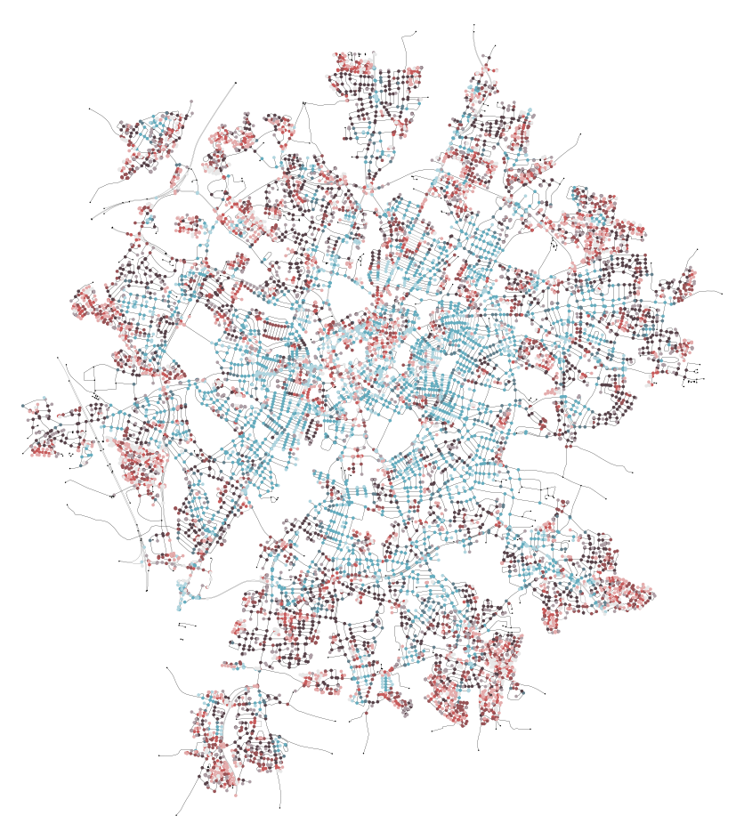

Stefano De Sabbata, Andrea Ballatore, Pengyuan Liu and Nicholas J. Tate

# Exploring urban form through graph neural networks



Graph theory has long provided the basis for the computational modelling of urban flows and networks and, thus, for the study of urban form. The development of graph-convolutional neural networks offers the opportunity to explore new applications of deep learning approaches in urban studies. In this project, we explore the use of an unsupervised graph representation learning framework for analysing urban street networks (see [methods and code](#methods-code) below). 

Our preliminary results (see [results and supplementary materials](#results-supplementary) below) illustrate how a model trained on a 1% random sample of street junctions in the UK can be used to explore the urban form of the city of Leicester, generating embeddings which are similar but distinct from classic metrics and able to capture key aspects such as the shift from urban to suburban structures. 

<br clear="left"/>


## Data

We used the [Global Urban Street Networks](https://dataverse.harvard.edu/dataverse/global-urban-street-networks/) data made available by [Geoff Boeing](https://geoffboeing.com/), which include simplified street networks of 138 cities in the UK derived from [OpenStreetMap](https://www.openstreetmap.org/#map=12/52.6334/-1.1076). 

Create `storage` as a subfolder of the main directory, which will be used to store large data files
not to be syncronised with the GitHub repo. Download the 
[Global Urban Street Networks GraphML](https://dataverse.harvard.edu/dataset.xhtml?persistentId=doi:10.7910/DVN/KA5HJ3) 
files of interest into the `storage` and unzip them.

```shell
mkdir storage
mkdir storage/osmnx
mkdir storage/osmnx/zip
mkdir storage/osmnx/graphml
wget -O storage/osmnx/zip/united_kingdom-GBR_graphml.zip https://dataverse.harvard.edu/api/access/datafile/4287573
unzip storage/osmnx/zip/united_kingdom-GBR_graphml.zip -d storage/osmnx/graphml
```


## Environment

The conda environment used for the project is described in [this yml file](https://github.com/sdesabbata/gnn-urban-form/blob/main/utils/conda-env_gnn-urban-form.yml) (please see [this README file](https://github.com/sdesabbata/gnn-urban-form/tree/main/utils#readme) as well).


## Methods and code

We developed a graph autoencoder model using [PyTorch Geometric](https://pytorch-geometric.readthedocs.io/en/latest/). The encoder (see [`gnnuf_models.py`](https://github.com/sdesabbata/gnn-urban-form/blob/main/code/gnnuf_models.py)) is composed of three layers: two layers using modified graph isomorphism operators designed to incorporate the edge attributes in the aggregation step of the convolution, using 64 hidden features; and a linear layer, which reduces the 64 hidden features to 2 embeddings.  The decoder is a standard inner product operator. 

To train our model (see [`gnnuf_train.py`](https://github.com/sdesabbata/gnn-urban-form/blob/main/code/gnnuf_train.py)), we randomly sampled 1\% of the nodes from 137 cities in the UK, leaving Leicester as a case study to explore the effectiveness of our model.

To evaluate the model, we used it to generate embeddings for all street junctions in Leicester -- see [`gnnuf_embedding_Leicester.py`](https://github.com/sdesabbata/gnn-urban-form/blob/main/code/gnnuf_embedding_Leicester.py) for node embeddings and [`gnnuf_embedding_pool_Leicester.py`](https://github.com/sdesabbata/gnn-urban-form/blob/main/code/gnnuf_embedding_pool_Leicester.py) for embeddings pooled at node ego-graph level. 

In our preliminary analysis (see [results and supplementary materials](#results-supplementary) below), we qualitatively explore the expressiveness of the model through a series of plots and maps, and we quantitatively compare the embeddings with closeness and betweenness centrality, both based on the whole city graph and based on the node's ego-graph (see [`osmnx_stats_node_centrality_with_egograph_Leicester.py`](https://github.com/sdesabbata/gnn-urban-form/blob/main/code/osmnx_stats_node_centrality_with_egograph_Leicester.py)), as well as basic statistics (as provided by OSMnx) for each node's ego-graph (see [`osmnx_stats_egograph_basic_Leicester.py`](https://github.com/sdesabbata/gnn-urban-form/blob/main/code/osmnx_stats_egograph_basic_Leicester.py)).


## Results and supplementary materials

The pages below present the main results obtained from our analysis as a jupyter notebook compiled to html, alongside an additional quarto document.

- [Exploratory analyses of the results obtained for Leicester](gnnuf_exploratory_analysis_v0-5-emb_Leicester.html)
  - [additional correlations pairs-plot created in R](gnnuf_exploratory_analysis_v0-5-emb_Leicester_correlations.html)


## Future work

Our preliminary results illustrate the potential of GNNs to develop an unsupervised framework to capture and explore urban form, but a more thorough exploration of the design space is necessary.

In our future work, we aim to expand the use of our framework in three aspects. First, we aim to explore the adaptability and usefulness of our approach through space, time and scale, testing how models behave when using a continental or global dataset for training, including past street networks  or limiting the training to cities of the same scale as the target one(s). Second, we will explore how to encode places beyond junctions, including buildings or points of interest. Third, we will explore how to encode flows beyond networks, including commuting or communications.


## Acknowledgements

The authors acknowledge the work of [OpenStreetMap](https://www.openstreetmap.org/#map=12/52.6334/-1.1076) contributors and [Geoff Boeing](https://geoffboeing.com/) in creating the [data](https://dataverse.harvard.edu/dataverse/global-urban-street-networks/) that made this work possible. This research used the ALICE High Performance Computing Facility at the University of Leicester.
