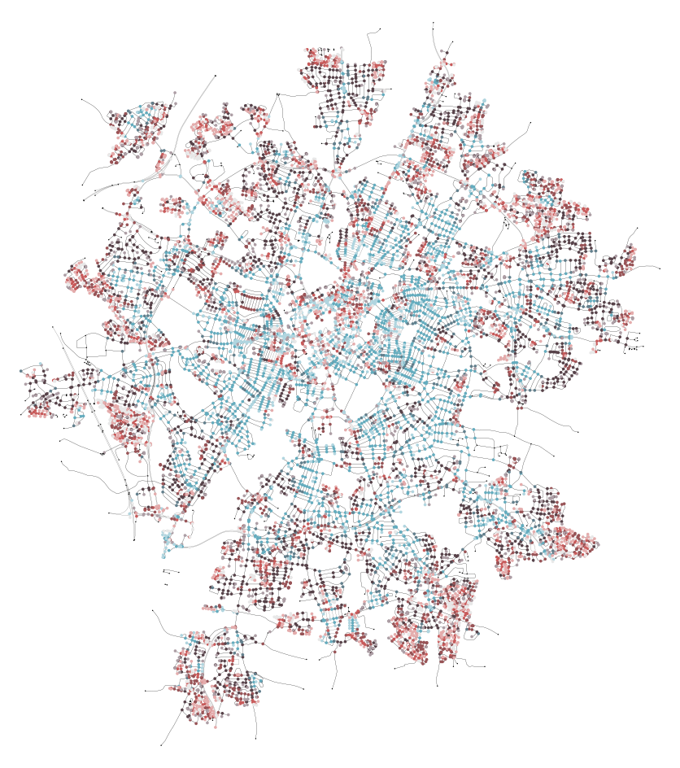

# Learning urban form through unsupervised graph-convolutional neural networks

Graph theory has long provided the basis for the computational modelling of urban flows and networks and, thus, for the study of urban form. The development of graph-convolutional neural networks offers the opportunity to explore new applications of deep learning approaches in urban studies. In this paper, we propose an unsupervised graph representation learning framework for analysing urban street networks. Our results illustrate how a model trained on a 1% random sample of street junctions in the UK can be used to explore the urban form of the city of Leicester, generating embeddings which are similar but distinct from classic metrics and able to capture key aspects such as the shift from urban to suburban structures. We conclude by outlining the current limitations and potential of the proposed framework for the study of urban form and function. 

## Methods and code

All the code used for this project is available on [our GitHub repo](https://github.com/sdesabbata/gnn-urban-form).

## Results and supplementary materials

The pages below present the main results obtained from our analysis as a jupyter notebook compiled to html, alongside an additional quarto document.

- [Exploratory analyses of the results obtained for Leicester](gnnuf_exploratory_analysis_v0-5-emb_Leicester.html)
  - [additional correlations pairs-plot created in R](gnnuf_exploratory_analysis_v0-5-emb_Leicester_correlations.html)

